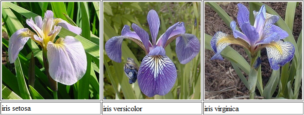

```{r setup, include=FALSE, warning=FALSE, error=FALSE, message=FALSE}
knitr::opts_chunk$set(echo = TRUE, eval = TRUE)
```

## Introduction

* In this session, we analyze the famous (Fisher's or Anderson's) iris data from the R library `datasets`.

```{r, fig.align = "center", out.width = "600px", echo=FALSE}

```

* Install the following package if you don't have it.

```
                install.packages("datasets");
                #library(datasets); #it is loaded automatically
``` 

* The data set gives the measurements in centimeters of the variables sepal length and width and petal length and width, respectively, for 50 flowers from each of 3 species of iris. The species are Iris setosa, versicolor, and virginica. 


* We consider summary statistics of the data.

* We consider Histogram and Density Plot, Box plot, Bar charts, scatter plot, and pairwise scatter plot.


## Data summary

```{r}
data1 = iris;   # ?iris
dim(data1);
str(data1);
head(data1);
tail(data1);
```

```{r}
summary(data1);
```

## Graphics

### Histograms and density plots

```{r,echo = TRUE,out.width = '100%',fig.align = 'center'}
Sepal.Length = data1$Sepal.Length;
Sepal.Width = data1$Sepal.Width;
Petal.Length = data1$Petal.Length;
Petal.Width= data1$Petal.Width;
# These four variables are numerical

par(mfrow=c(2,2));
hist(Sepal.Length, main='Histogram of Sepal Length');
hist(Sepal.Width, main='Histogram of Sepal Width');
hist(Petal.Length, main='Histogram of Petal Length');
hist(Petal.Width, main='Histogram of Petal Width');
```

* We may prefer to see both the histogram and density plot for each variable.  But we should consider **relative frequecny** histograms using the option `freq=F`.

* After the `hist()` function, we add the density curve using the `lines()` function.


```{r,echo = TRUE,out.width = '100%',fig.align = 'center'}
par(mfrow=c(2,2));
hist(Sepal.Length, freq=F, main='Histogram of Sepal Length plus Density Plot');
lines(density(Sepal.Length), col=2, lty=1, lwd=2);  

hist(Sepal.Width, freq=F, main='Histogram of Sepal Width plus Density Plot');
lines(density(Sepal.Width), col=2, lty=1, lwd=2); 

hist(Petal.Length, freq=F, main='Histogram of Petal Length plus Density Plot');
lines(density(Petal.Length), col=2, lty=1, lwd=2); 

hist(Petal.Width, freq=F, main='Histogram of Petal Width plus Density Plot');
lines(density(Petal.Width), col=2, lty=1, lwd=2); 
```


### Box plots

```{r,echo = TRUE,out.width = '100%',fig.align = 'center'}
par(mfrow=c(2,2));
boxplot(Sepal.Length, main='Boxplot of Sepal Length');
boxplot(Sepal.Width, main='Boxplot of Sepal Width'); #outliers
boxplot(Petal.Length, main='Boxplot of Petal Length');
boxplot(Petal.Width, main='Boxplot of Petal Width');
```

* To compare the four varialbes, we plot Side-by-side Boxplot.

```{r,echo = TRUE,out.width = '100%',fig.align = 'center'}
boxplot(data1[,1:4], col=c(2,3,4,5), main='Side-by-side Boxplot'); 
```

* We may want to see the box plots of each variable for three Species.


```{r,echo = TRUE,out.width = '100%',fig.align = 'center'}
par(mfrow=c(2,2));
boxplot(Sepal.Length~Species, data=data1, col=c(6,7,8), main="Boxplot of Sepal Length");
boxplot(Sepal.Width~Species, data=data1, col=c(6,7,8), main="Boxplot of Sepal Width");
boxplot(Petal.Length~Species, data=data1, col=c(6,7,8), main="Boxplot of Petal Length");
boxplot(Petal.Width~Species, data=data1, col=c(6,7,8), main="Boxplot of Petal Width");
```

### Bar charts


* It can be seen that there are 50 observations for each species. 

```{r,echo = TRUE,out.width = '100%',fig.align = 'center'}
counts= table(data1$Species ); 
counts;
```

* We want to investigate the proportion of a variable exceeding a threshold.   In this lab, let's consider the Sepal.Length variable only.


```{r,echo = TRUE,out.width = '100%',fig.align = 'center'}
data1$Flag = data1$Sepal.Length>5; # Add a binary flag, TRUE if Sepal.Length>5, FALSE otherwise.
count1=table(data1$Species[data1$Flag]);  #get the count of three species with Sepal.Length>5
count1;
barplot(count1, col=c(5,6,7), main='Distribution of the species with Sepal.Length>5')
```

* Check the complete distribution of the three species

```{r,echo = TRUE,out.width = '100%',fig.align = 'center'}
count2=table(data1$Species, data1$Flag);
count2;
barplot(count2, col=c(5,6,7), beside=TRUE,names.arg=c("Sepal.Length<=5",  "Sepal.Length>5"), main='Distribution of the species');
```


### Scatter plots

* We use scatter plots to check the relationship between two variables


```{r,echo = TRUE,out.width = '100%',fig.align = 'center'}
x1=data1$Sepal.Length;
y1=data1$Sepal.Width;
x2=data1$Petal.Length;
y2=data1$Petal.Width;
par(mfrow=c(1,2));
plot(x=x1, y =y1, xlab="Sepal.Length", ylab="Sepal.Width");
plot(x=x2, y = y2, xlab="Petal.Length", ylab="Petal.Width");
```


* Different colors can be specified for different species in a scatter plot.

```{r,echo = TRUE,out.width = '100%',fig.align = 'center'}
z = data1$Species;
par(mfrow=c(1,2));
plot(x=x1, y =y1, pch=20, col=c(2,3,4)[z],xlab="Sepal.Length", ylab="Sepal.Width");
legend("topleft", levels(z), pch=20, col=c(2,3,4));
plot(x=x2, y = y2, pch=20, col=c(2,3,4)[z],xlab="Petal.Length", ylab="Petal.Width");
legend("topleft", levels(z), pch=20, col=c(2,3,4));
```

* The following is a scatter plot matrix.

```{r,echo = TRUE,out.width = '100%',fig.align = 'center'}
pairs(data1[,1:4], main="Scatter plot matrix of the four variables",lower.panel = NULL);
#pairs(~Sepal.Length+Sepal.Width+Petal.Length+Petal.Width,data=data1,lower.panel = NULL);
```

* The following is a scatter plot matrix.

* Again, we can identify the species.

```{r,echo = TRUE,out.width = '100%',fig.align = 'center'}
pairs(data1[,1:4], col = c(4,5,6)[data1$Species], main="Scatter plot matrix of the four variables",lower.panel = NULL);
```
